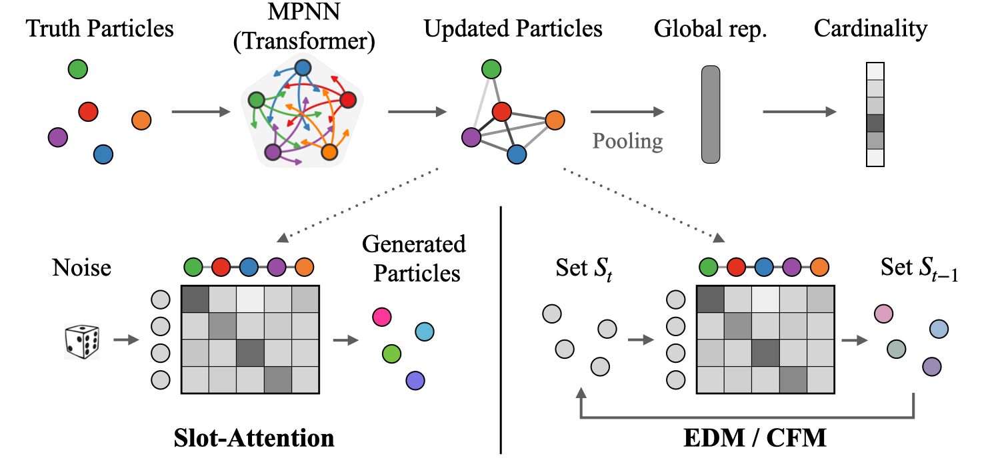

# Official repository for "Advancing Set-Conditional Set Generation" paper

This repository contains the code for the paper "Advancing Set-Conditional Set Generation: Diffusion Models for Fast Simulation of Reconstructed Particles", [arXiv:2405.10106](https://arxiv.org/abs/2405.10106).



The dataset used in the paper can be found [here](https://zenodo.org/records/11383444).\
Code for the diffusion models is located in the `fm-edm` folder, while the code for the baseline slot attention model is located in the `SA_baseline` folder.

## Requirements
The list of packages required to train/evaluate models is found at `requirements.txt` file. All studies were done with `Python 3.8.15`.

## Training

Models were trained using first 1M jets from the `unique_jets_1.root` file. The training script is provided in the `train.py` file. The script can be run as follows:

```bash
python train.py -c <path_to_config_file> --gpus 0
```

## Evaluation

The evaluation script is provided in the `eval.py` file. The script can be run as follows:

```bash
python eval.py -c <path_to_config> -p <path_to_checkpoint> -n <num_steps> --test_path <path_to_test_file> -ne <number_of_events> -bs <batch_size> -npf
```

Pre-trained models used in the paper can be found in the `trained_models` folder.
